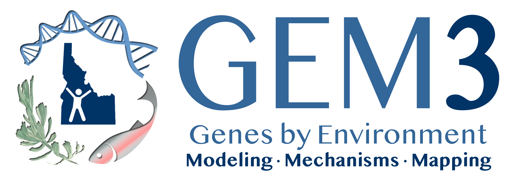

```{js logo-js, echo=FALSE}
$(document).ready(function() {
});
```

```{r packages, echo=FALSE, warning=FALSE, include=FALSE}
library(knitr)
library(rmarkdown)
library(bookdown)
#library(distill)
library(knitcitations)
library(formatR)
library(devtools)
library(kfigr)
library(dplyr)
library(kableExtra)
library(tufte)
#Generate BibTex citation file for all R packages used to produce report
knitr::write_bib(.packages(), file = 'packages.bib')
```

```{r repo, echo=FALSE, fig.align = 'center', out.width = '100%'}

```

# Vision Statement

This genomics workflow was created by Idaho EPSCoR [GEM3](https://www.idahogem3.org) participants and attendees of the 2023 Smithsonian School of Conservation Bioinformatics Analysis of Conservation Genomics Workshop with George Mason University through support of GEM3. The purpose of this workflow module is to share what was learned in this workshop and build capacity in conservation genomics and bioinformatics.

# What Will Be Covered?

Please follow this workflow to learn about how to process raw genomic resequencing data, as well as downstream analysis options. Further downstream analyses are captured in the following repository: [GEM3Genomics/Genomics_Downstream_Analyses](https://github.com/Gem3Genomics/Genomics_Downstream_Analyses). 

**Disclaimer: This workflow was developed in March 2023 with bioinformatic and genomic research recommendations at that time. Please note that program versions and recommendations will likely change with time due to the nature of this quickly evolving field.**

# What Is Required?

You will need access to an High Performance Computing (HPC) machine, as well as R for downstream analyses. Knowledge of job script format, how to submit jobs, and how to compute in an interactive node specific to your institution's HPC will also be necessary.

# Acknowledgements

This module was made possible by the NSF Idaho EPSCoR Program and by the National Science Foundation under award number OIA-1757324. Special thanks to the [Smithsonian-Mason School of Conservation](https://smconservation.gmu.edu) and its instructors for this teaching this material.

# Licensing

<a rel="license" href="http://creativecommons.org/licenses/by/4.0/"></a><br />This work is licensed under a <a rel="license" href="http://creativecommons.org/licenses/by/4.0/">Creative Commons Attribution 4.0 International License</a>.
